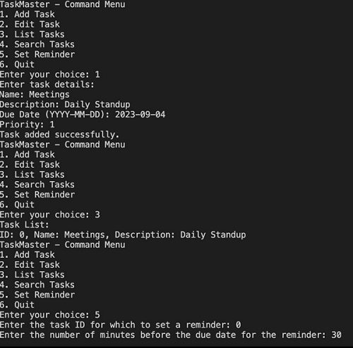

# TaskMaster

TaskMaster is a command-line task management tool that allows you to manage your tasks efficiently.



## Features

- Add tasks with details such as name, description, due date, and priority.
- Edit task details, including name and description.
- List all tasks.
- Search for tasks based on keywords.
- Set reminders for tasks to keep track of important deadlines.

## Getting Started

To get started with TaskMaster, follow these steps:

1. Clone the repository to your local machine:

   ```shell
   git clone https://github.com/abhi7275/TaskMaster.git

2. Compile the source code:
   ```shell
   g++ main.cpp algo.cpp -o taskmaster

3. Run the application:

   ```shell
   ./taskmaster

Usage

TaskMaster provides a simple and interactive command-line interface. Here are the available commands:

    Add Task: Add a new task with details.
    Edit Task: Modify the name and description of an existing task.
    List Tasks: Display a list of all tasks.
    Search Tasks: Search for tasks containing specific keywords.
    Set Reminder: Set a reminder for a task with a specified time before the due date.
    Quit: Exit the application.

Contributing

Contributions are welcome! If you'd like to contribute to this project, please follow these steps:

    Fork the repository on GitHub.
    Create a new branch with a descriptive name.
    Make your changes and commit them.
    Push your changes to your fork.
    Create a pull request with a clear title and description.

Author

    Abhishek Kumar
    GitHub: github.com/abhi7275

License

This project is licensed under the MIT License - see the LICENSE file for details.
